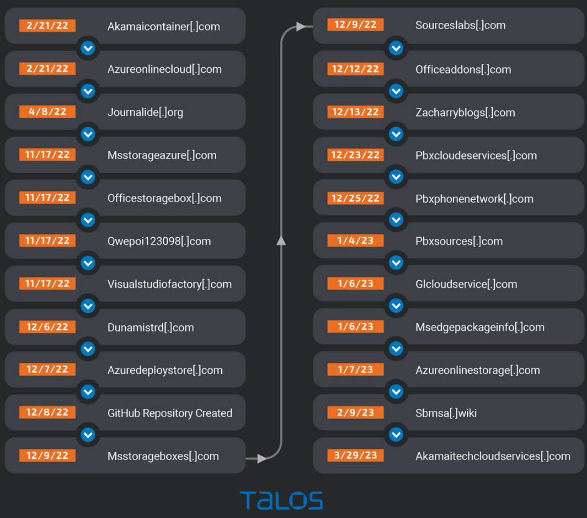

# Cisco Talos Blog  

  

# Threat Advisory: 3CX Softphone Supply Chain Compromise  

By Cisco Talos  

THURSDAY, MARCH 30, 2023 18:29  

THREAT ADVISORY  

Cisco Talos is tracking and actively responding to a supply chain attack involving the 3CX Desktop Softphone application.  

This is a multi-stage attack that involves sideloading DLLs, seven-day sleep routines, and additional payloads dependent on a now-removed GitHub repository for Windows-based systems.   
MacOS systems used a different infection chain leveraging a hardcoded C2 domain, as opposed to the GitHub repo.   
This is just the latest supply chain attack threatening users, after the SolarWinds incident in 2020 and the REvil ransomware group exploiting Kaseya VSA in 2021.  

# Summary  

Cisco Talos recently became aware of a supply chain attack affecting Windows and MacOS users of the 3CX software-based phone application. This attack leveraged the legitimate update functionality of the 3CX application to deliver a set of malicious payloads to 3CX users.  

The infection chain consists of several stages and involves sideloading DLLs along with a sevenday sleep cycle before the malware attempts to retrieve additional malicious artifacts from a now-removed GitHub repository for the Windows based infection. The GitHub repository hosted a series of icon files with encrypted data appended to the end of the files. These encrypted strings, once decrypted, contained the C2 domains for additional malicious artifacts.  

The MacOS version used a hard coded C2 domain. These second-stage payloads are information stealers that attempt to obtain system information and the latest browsing history records, indicating this information may be used as a filtering mechanism to identify and discard some victims while maintaining unauthorized access to others.  

During our investigation we were able to see file activity dating back to February 3, 2023. However, the GitHub repository has been active since December 2022. The full scope of the attack is uncertain at this point. The 3CX website claims to have over 600,000 customers and 12 million daily users. It's unclear how many are users of the 3CX Desktop App versus the web app option that was not affected. 3CX is currently asking users to use the web app while they work to release an update.  

# Preparing since February 2022  

Based on Cisco Talos investigation, it appears the infrastructure that supported this attack was being prepared as early as February 2022 when the domains were first registered. A second cluster of activity happened toward the end of 2022 when the GitHub repository was created, along with a few other domains. The sbmsa[.]wiki domain was also created on Feb. 9, 2023, which was found to be used by the second stage of the MacOS version.  

The timeline below illustrates these clusters of activity.  

  

Threat Advisory: 3CX Softphone Supply Chain Compromise   

<html><body><table><tr><td rowspan="6"></td><td>CiscoSecureEndpoint (AMPforEndpoints)</td><td>Cloudlock</td><td>CiscoSecureEmail</td><td>CiscoSecureFirewall/SecureIPS (NetworkSecurity)</td></tr><tr><td></td><td>N/A</td><td>N/A</td><td></td></tr><tr><td>CiscoSecureMalwareAnalytics (ThreatGrid)</td><td>CiscoUmbrellaDNSSecurity</td><td>CiscoUmbrellaSIG</td><td>CiscoSecureWebAppliance (WebSecurityAppliance)</td></tr><tr><td></td><td></td><td></td><td></td></tr></table></body></html>  

Cisco Secure Endpoint (formerly AMP for Endpoints) is ideally suited to prevent the execution of the malware detailed in this post. Try Secure Endpoint for free here.  

Cisco Secure Email (formerly Cisco Email Security) can block malicious emails sent by threat actors as part of their campaign. You can try Secure Email for free here.  

Cisco Secure Firewall (formerly Next-Generation Firewall and Firepower NGFW) appliances such as Threat Defense Virtual, Adaptive Security Appliance and Meraki MX can detect malicious activity associated with this threat.  

Cisco Secure Network/Cloud Analytics (Stealthwatch/Stealthwatch Cloud) analyzes network traffic automatically and alerts users of potentially unwanted activity on every connected device.  

Cisco Secure Malware Analytics (Threat Grid) identifies malicious binaries and builds protection into all Cisco Secure products.  

Umbrella, Cisco’s secure internet gateway (SIG), blocks users from connecting to malicious domains, IPs and URLs, whether users are on or off the corporate network. Sign up for a free trial of Umbrella here.  

Cisco Secure Web Appliance (formerly Web Security Appliance) automatically blocks potentially dangerous sites and tests suspicious sites before users access them.  

Additional protections with context to your specific environment and threat data are available from the Firewall Management Center.  

Cisco Duo provides multi-factor authentication for users to ensure only those authorized are accessing your network.  

Open-source Snort Subscriber Rule Set customers can stay up to date by downloading the latest rule pack available for purchase on Snort.org.  

Talos created the following coverage for this:  

Snort SIDs:  

Snort 3: 300480,300481  

# Orbital Queries  

Cisco Secure Endpoint users can use Orbital Advanced Search to run complex OSqueries to see if their endpoints are infected with this specific threat. For specific OSqueries on this threat, Cisco Secure Endpoint customers need to make sure that $\angle A B A=\angle C D A$ is entered into the program field under the "Installed Program Search" for Windows and ".\*3CX.\*" under "Installed Applications Monitoring" for MacOS in Orbital.  

Additionally, the users can access the OSQueries directly on GitHub for both Windows and MacOS.  

Indicators of Compromise (IOCs)  

Indicators of compromise (IOCs) associated with ongoing activity can be found here.  

ArcaneDoor - New espionage-focused campaign found targeting perimeter network devices  

A P R I L 2 4 , 2 0 2 4 1 1 : 5 4  

ArcaneDoor is a campaign that is the latest example of state-sponsored actors targeting perimeter network devices from multiple vendors. Coveted by these actors, perimeter network devices are the https://blog.talosintelligence.com/3cx-softphone-supply-chain-compromise/ perfect intrusion point for espionage-focused campaigns.  

Large-scale brute-force activity targeting VPNs, SSH services with commonly used login credentials  

A P R I L 1 6 , 2 0 2 4 0 8 : 0 0  

Cisco Talos would like to acknowledge Anna Bennett and Brandon White of Cisco Talos and Phillip Schafer, Mike Moran, and Becca Lynch of the Duo Security Research team for their research that led to the identification of these attacks. Cisco Talos is actively monitoring a global increase in brute-force attacks  

Active exploitation of Cisco IOS XE Software Web Management User Interface vulnerabilities  

O CTO B E R 1 6 , 2 0 2 3 1 1 : 0 5  

Cisco has identified active exploitation of two previously unknown vulnerabilities in the Web User Interface (Web UI) feature of Cisco IOS XE software — CVE-2023-20198 and CVE-2023-20273 — when exposed to the internet or untrusted networks.  

# INTELLIGENCE CENTER INCIDENT RESPONSE  

# MEDIA  

Intelligence Search Email & Spam Trends  

Reactive Services Proactive Services Emergency Support  

Talos Intelligence Blog Threat Source Newsletter Beers with Talos Podcast Talos Takes Podcast Talos Videos  

# VULNERABILITY RESEARCH  

Vulnerability Reports Microsoft Advisories  

# SECURITY RESOURCES  

Open Source Security Tools   
Intelligence Categories   
Reference   
Secure Endpoint Naming   
Reference  

SUPPORT Support Documentation  

# ...... CISCO  

© 2025 Cisco Systems, Inc. and/or its affiliates. All rights reserved. View our Privacy Policy.  